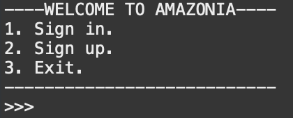

# Amazonia

Amazonia is a software that manages products and categories of a store.

This software was created as a university practice. When the semester is over this repository will be archived and also will become private.

## Table of Contents

- [Project tree](#project-tree)
- [Usage](#usage)
  - [Administrator](#administrator)
  - [User](#user)
  - [Model - View - Controller](#model-view-controller)
  - [Input / Output](#input-output)
  - [Sign In - Sign up](#sign-in-sign-up)
- [Installation](#installation)
- [Credits](#credits)
- [License](#license)

## Project tree

- resources: store images to display in readme.
- data: data is a hide directory that store program data as a hide file.
- src: source code and tests.
  - main: all source code.
    - java: java files.
      - Main.java: main class to execute program.
      - model: package with all my data structures.
      - controller: package with my controllers class.
      - view: package with all the views.
      - io: package with input/output classes.
  - test: all tests.
    - java: java files.
      - model: package with all my data structures tests.
      - controller: package with my controllers class tests.
      - io: package with input/outputs classes.
- .classpath: file of eclipse project.
- .gitignore: ignore files of the project.
- .project: file  of eclipse project.
- LICENSE: license file.
- README: readme file.

## Usage

### Administrator

An administrator can create products and categories.

### User

A user look all the products and from a category, can buy products and see their profiles.

### Model - View - Controller

**Model**:

- User: handle data of a user.
- Product: handle data of a product.
- Category: handle data of a category.

**View**:

- Class that have the ability to show the command line user interface such as BuyView or ProfileView.

**Controller**:

- Class that creates the connections between the user interface (View) and the data structures (Model).
- All controllers class inherit from class Controller.

### Input / Output

**Input**:

With serialization Amazonia introduces intelligent storage with 3 files generated by the program:

- .users
- .products
- .categories

This files are read by input class.

**Output**

Output class manage to override the files mentioned above and maintain updated the project when you exit the program.

### Sign In - Sign Up

Now in Amazonia you can sign in and sign up in a new login menu that have support with Input / Output classes. 

## Installation

To execute the software or change the source code I highly recommend to use Eclipse. This repository comes with several file to structure easily a Java Eclipse Project.

## Credits

Creator of the project: [@joseluishozg](https://github.com/joseluishozg) & Colaborator of the project : [@andresbravom](https://github.com/andresbravom)

## License

This software is licensed under [GPL-3.0 license](https://www.gnu.org/licenses/quick-guide-gplv3). For more information please read [LICENSE](./LICENSE).
