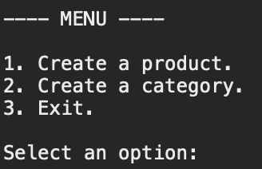
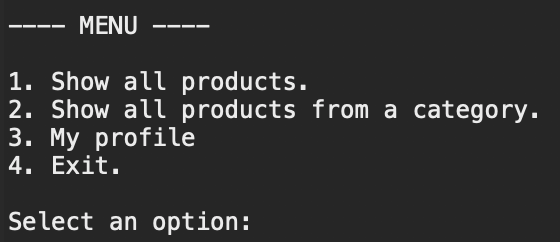
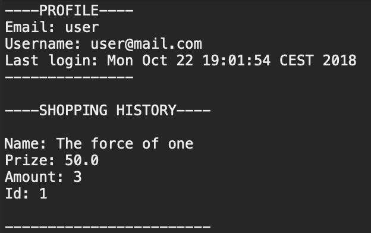

# Practice 1: Advanced Programming Techniques

Amazonia is a software that manages products and categories of a store.

This software was created as a university practice. When the semester is over this repository will be archived and also will become private.

## Table of Contents

- [Project tree](#project-tree)
- [Usage](#usage)
  - [Administrator](#administrator)
  - [User](#user)
  - [Model - View - Controller](#model-view-controller)
- [Installation](#installation)
- [Credits](#credits)
- [License](#license)

## Project tree

- resources: store images to display in readme.
- src: source code.
  - Main.java: main class.
  - model: package with all my data structures.
  - test: package of all my tests.
  - view: package with all the views.
  - controller: package with my controllers class.
- .classpath: file of eclipse project.
- .gitignore: ignore files of the project.
- .project: file  of eclipse project.
- LICENSE: license file.
- README: readme file.

## Usage

### Administrator

An administrator can create products and categories.

### User

A user look all the products and from a category, can buy products and see their profiles.

### Model - View - Controller

**Model**:

- User: handle data of a user.
- Product: handle data of a product.
- Category: handle data of a category.

**View**:

- Class that have the ability to show the command line user interface such as BuyView or ProfileView.

**Controller**:

- Class that creates the connections between the user interface (View) and the data structures (Model).
- All controllers class inherit from class Controller.

## Installation

To execute the software or change the source code I highly recommend to use Eclipse. This repository comes with several file to structure easily a Java Eclipse Project.

## Credits

Creator of the project: [@joseluishozg](https://github.com/joseluishozg)

## License

This software is licensed under [GPL-3.0 license](https://www.gnu.org/licenses/quick-guide-gplv3). For more information please read [LICENSE](./LICENSE).
